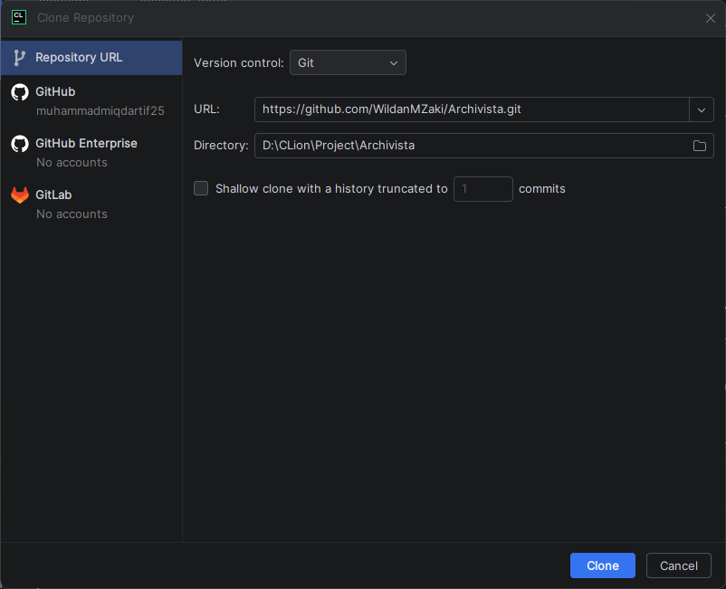
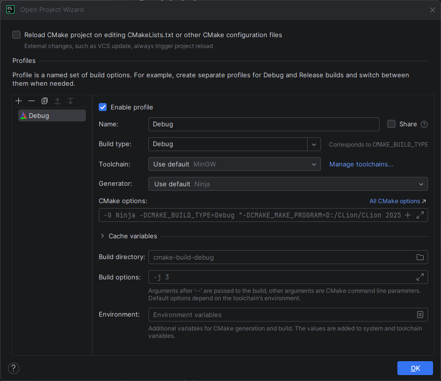
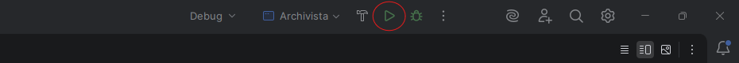

# Archivista

Simple text editor application built with **C** and **Win32 API**.

---

## 📋 Requirements

Pastikan tools berikut sudah terinstall sebelum memulai setup project:

| Tool          | Keterangan               | Link Download                                     |
| ------------- | ------------------------ | ------------------------------------------------- |
| **MinGW-w64** | C Compiler untuk Windows | [winlibs.com](https://winlibs.com/)               |
| **CMake**     | Build system             | [cmake.org/download](https://cmake.org/download/) |
| **Git**       | Version control          | [git-scm.com](https://git-scm.com/)               |

Pastikan `mingw64\bin` dan `cmake\bin` sudah ditambahkan ke **System Environment Variable PATH**.

Contoh path MinGW: `D:\apps\winlibs\mingw64\bin`

Untuk memverifikasi instalasi, jalankan perintah berikut di terminal:

```bash
gcc --version
cmake --version
```

---

## 🚀 Setup

### Visual Studio Code

1. **Clone repository:**

   ```bash
   git clone https://github.com/WildanMZaki/Archivista.git
   cd Archivista
   ```

2. **Buka folder project di VS Code:**

   ```bash
   code .
   ```

3. **Debug** — jalankan perintah berikut (wajib menggunakan `Command Prompt` atau `PowerShell`):

   ```bash
   debug
   ```

4. **Build release** (menghasilkan file `.exe` final):

   ```bash
   build-release
   ```

---

### CLion

1. **Install CLion**

   Unduh dari: [jetbrains.com/clion](https://www.jetbrains.com/clion/)

2. **Buka CLion dan clone repository**

   Setelah CLion terbuka, pilih **File > New > Project from Version Control**, masukkan URL repository berikut, lalu klik **Clone**:

   ```
   https://github.com/WildanMZaki/Archivista.git
   ```

   
   > *Navigasi ke File → New → Project from Version Control, lalu tempel URL repository.*

3. **Konfigurasi project**

   Setelah proses clone selesai, project wizard akan muncul. Biarkan semua pengaturan dalam kondisi default, lalu klik **OK**.

   
   > *Biarkan pengaturan default dan klik OK untuk melanjutkan.*

4. **Build dan jalankan aplikasi**

   Klik tombol **Run** (▶) di pojok kanan atas untuk melakukan build dan menjalankan aplikasi.

   
   > *Klik tombol Run berwarna hijau untuk build dan menjalankan aplikasi.*

---

## 📦 Installation

> ⚠️ **Belum tersedia.** Installer/release `.exe` akan ditambahkan pada versi mendatang.

---

## 📝 Releases

Belum ada rilis. Pantau terus untuk update build terbaru.

---

## 👥 Team

### Anggota Kelompok

| NIM       | Nama                  | GitHub                                                         |
| --------- | --------------------- | -------------------------------------------------------------- |
| 251511062 | Wildan M Zaki         | [@WildanMZaki](https://github.com/WildanMZaki)                 |
| 251511050 | Muhammad Miqdar Salim | [@muhammadmiqdartif25](https://github.com/muhammadmiqdartif25) |

### Dosen Penanggung Jawab

**Yudi Widhiyasana, S.Si., MT**
